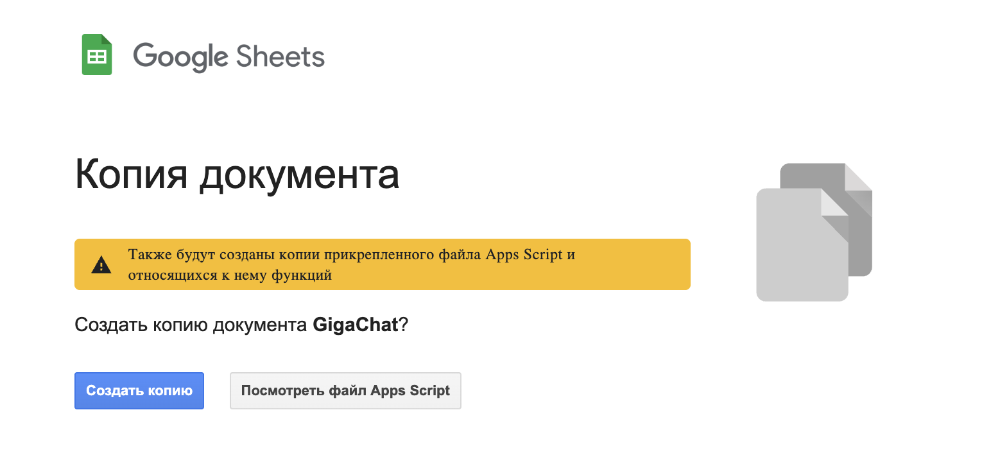
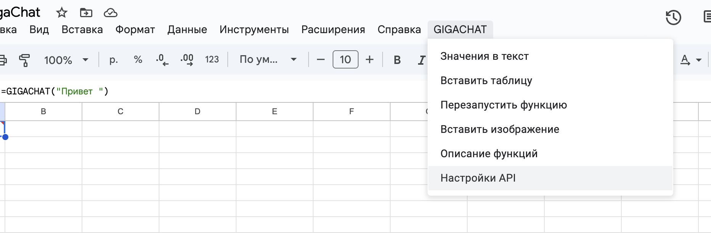
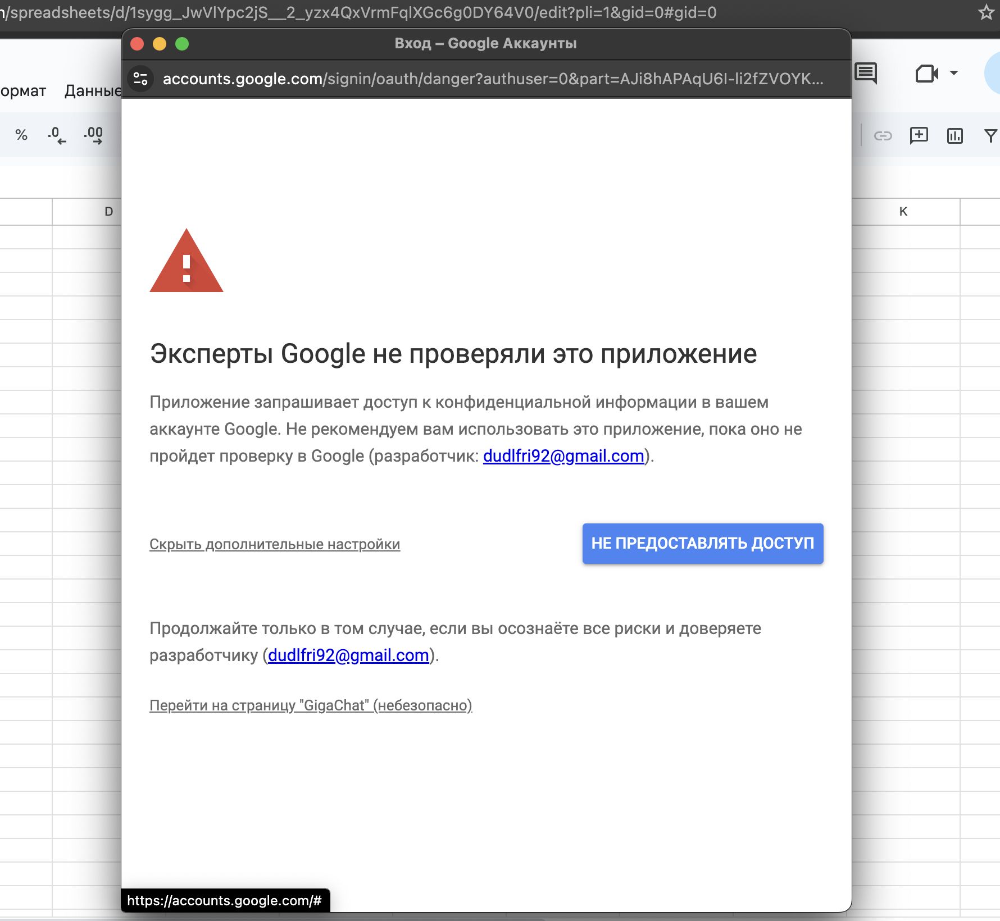
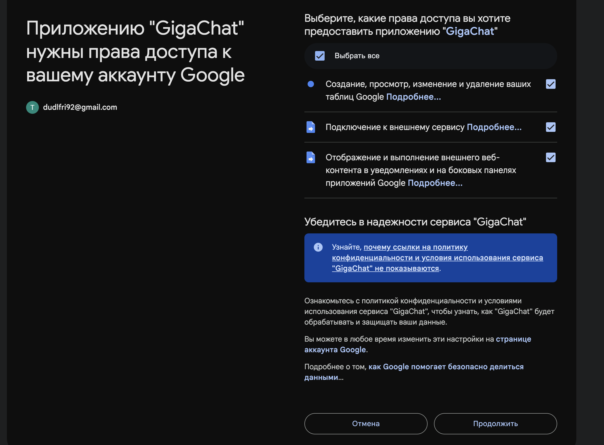
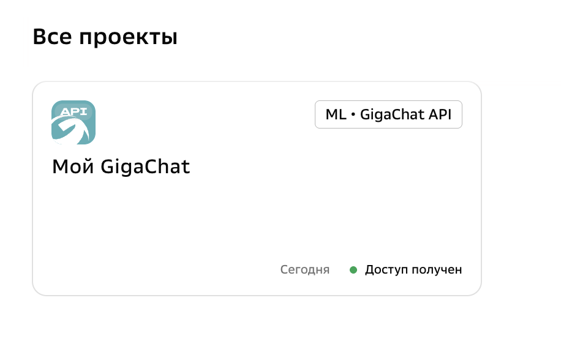
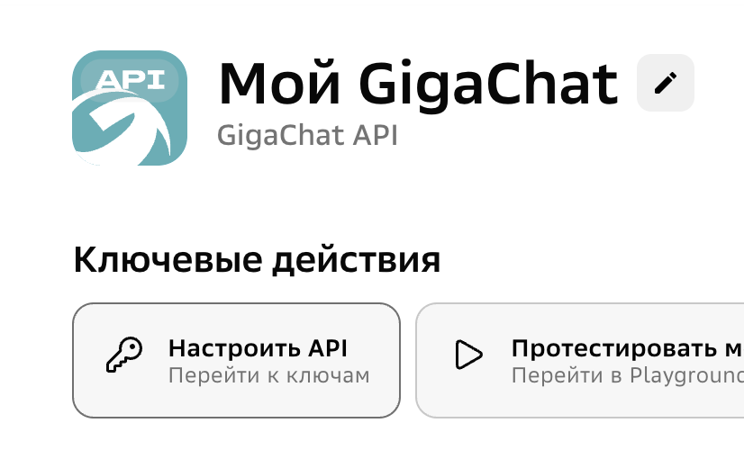
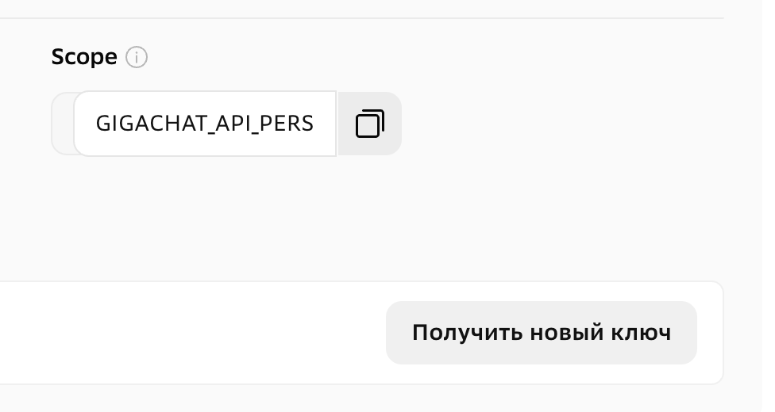
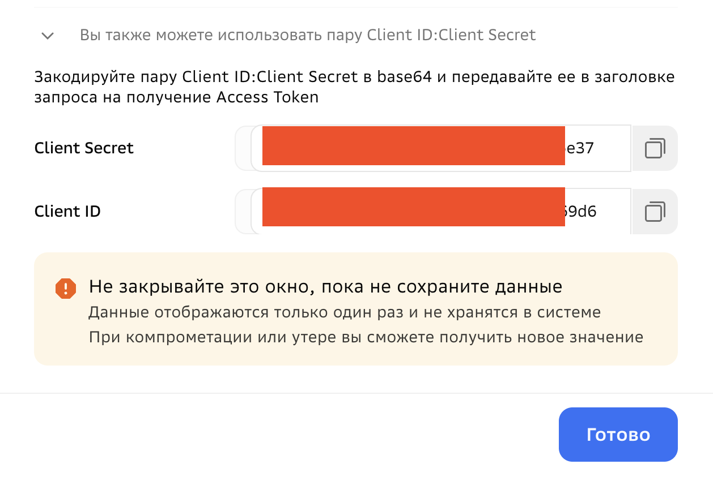
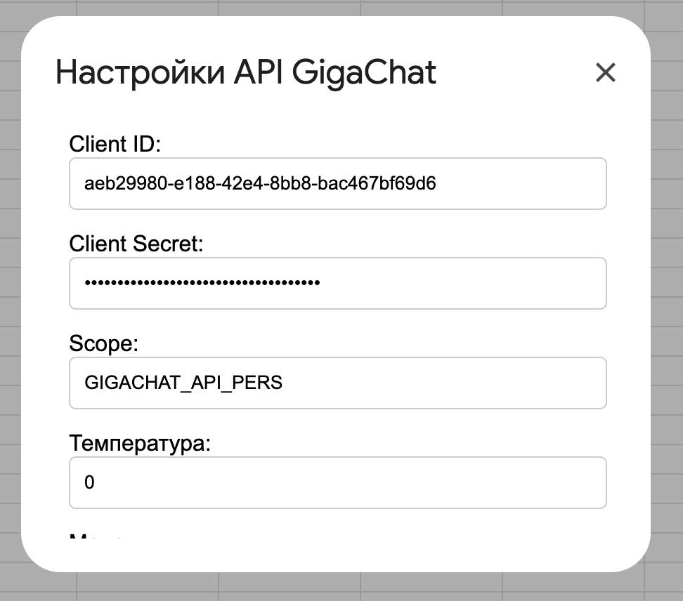
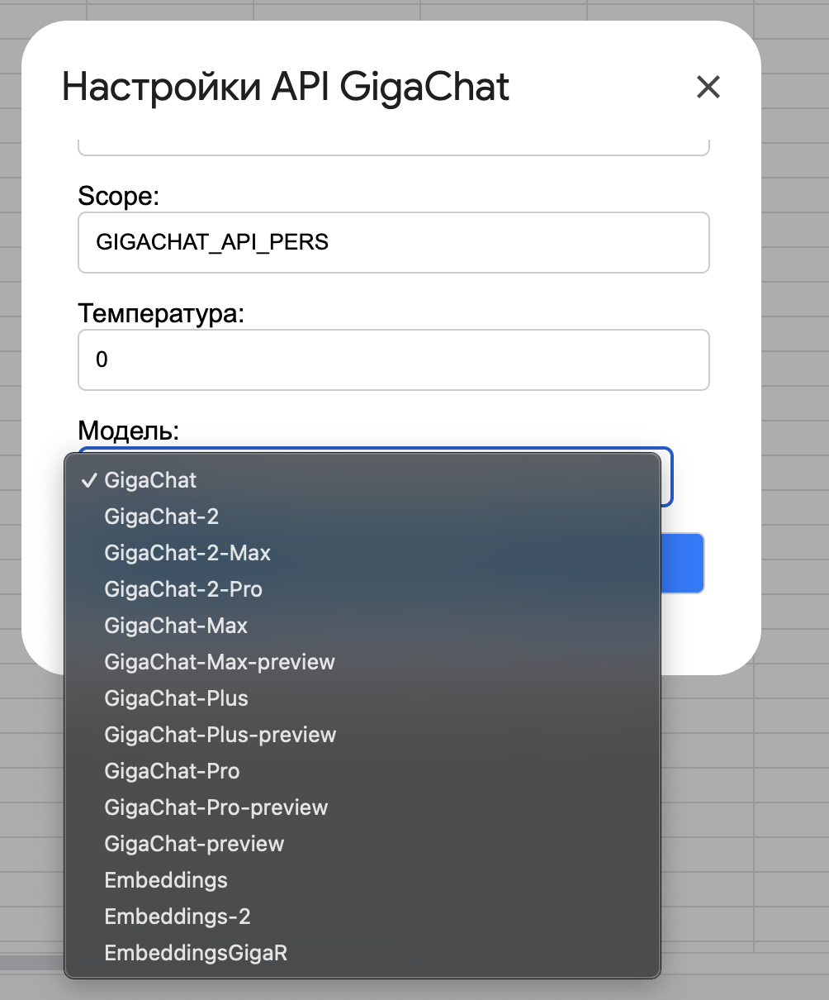

# Gigachat-for-Sheets: инструкция с компактными картинками

**Gigachat-for-Sheets** — это решение для интеграции GigaChat в **Google Таблицы** через Google Apps Script.

## 1. Копирование шаблонной таблицы

Перейдите по ссылке и сделайте копию таблицы:  
https://docs.google.com/spreadsheets/d/1t-nuewANiQLMFkUcIAGUv2nHVZ_QjH6WKK3fe6crDxA/copy

## 2. Активация меню GIGACHAT

В новой таблице в меню появится кнопка **GIGACHAT**.  
Выберите **«Настройки API»**, авторизуйтесь, предоставьте доступ.

    
    
  

## 3. Получение API-ключа

Получите API-ключ (Client ID, Client Secret, Scope) на сайте:  
https://developers.sber.ru/studio/workspaces

## 4. Вход в личный кабинет

Зайдите в раздел **«Мой GigaChat»**.

## 5. Настройка API-ключа

Нажмите **«Настроить API»**, создайте новый ключ, скопируйте **Client ID**, **Client Secret** и **Scope**.

    
    
  

## 6. Ввод данных в таблицу

Вернитесь в Google Таблицу, введите значения в настройках GIGACHAT → **«Настройки API»**, сохраните.

## 7. Выбор модели

После сохранения появится возможность выбрать модель GigaChat.

    
  

## 8. Проверка работы

Введите в ячейку формулу:

=GIGACHAT("Привет")

Если всё настроено верно, вы получите ответ от GigaChat.

---

**Поздравляю!**  
Теперь вы можете использовать GigaChat прямо в Google Таблицах!

